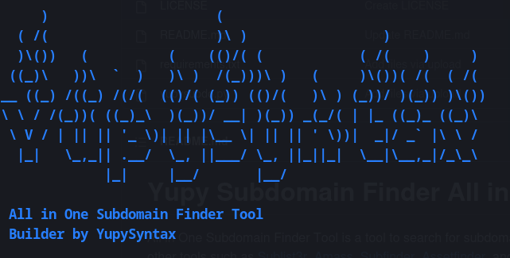

# Yupy Subdomain Finder All in One
All in One Subdomain Finder Tool is a tool to search for subdomains of an inputted domain. This tool uses several other tools such as [Sublist3r](https://github.com/aboul3la/Sublist3r), [Amass](https://github.com/OWASP/Amass), [Subfinder](https://github.com/projectdiscovery/subfinder), [Assetfinder](https://github.com/tomnomnom/assetfinder), and [Knockpy](https://github.com/guelfoweb/knock) to find subdomains. This program is written in Python and uses several libraries such as argparse and subprocess to read arguments from the command line and execute shell commands.
## Installation

To use this program, make sure Python 3 is installed on your computer. Then, follow these steps:

- Clone this repository by git ``clone https://github.com/0xYP/yupysubdo.git``
- Enter the repo directory by ``cd yupysubdo``
- Install all dependencies by ``pip install -r requirements.txt``
- Here you must have Sublist3r, Amass, Subfinder, Assetfinder, and Knockpy first to run this tool
- Run the program using ``python yupysubdo.py domain.com``

The program will request domain input from the user via command line arguments, then the program will run each tool to find subdomains of the input domain. Each subdomain search results from the tools will be combined into one set and stored in the output file with the name "hasil.txt". The program also displays a banner with ASCII art and a status message for each running tool.

## Use of Tools
```bash
python3 yupysubdo.py -h
usage: yupysubdo.py [-h] domain

All in One Subdomain Finder Tool

positional arguments:
  domain      example: yupysubdo.py domain.com

options:
  -h, --help  show this help message and exit
```

## Screenshots



## Dependencies
This program uses several dependencies as follows:

- argparse
- subprocess

Dependencies can be installed with the command pip install -r requirements.txt
## Contributing

This program is built by [Yupy Syntax](https://github.com/0xYP)

- [Sublist3r](https://github.com/aboul3la/Sublist3r)
- [Amass](https://github.com/OWASP/Amass)
- [Subfinder](https://github.com/projectdiscovery/subfinder)
- [Assetfinder](https://github.com/tomnomnom/assetfinder)
- [Knockpy](https://github.com/guelfoweb/)

## License

[MIT](https://choosealicense.com/licenses/mit/)

